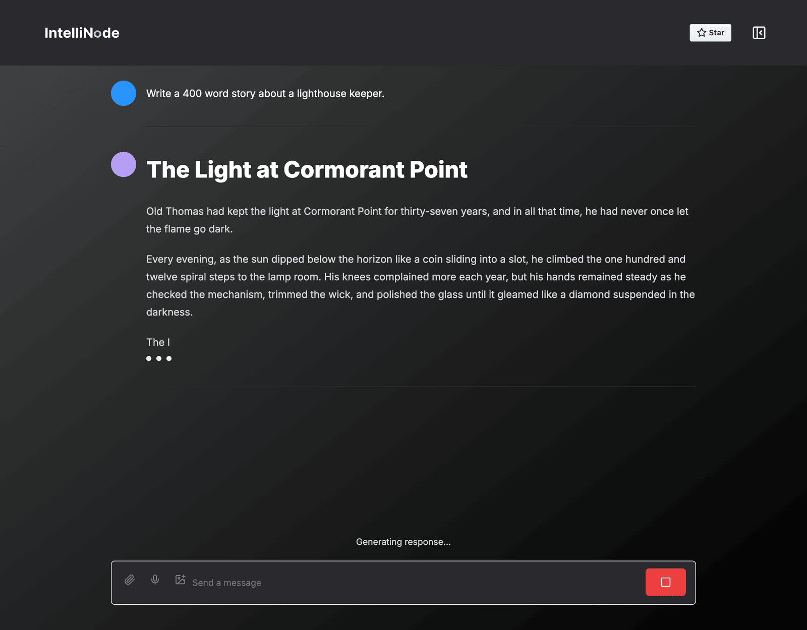
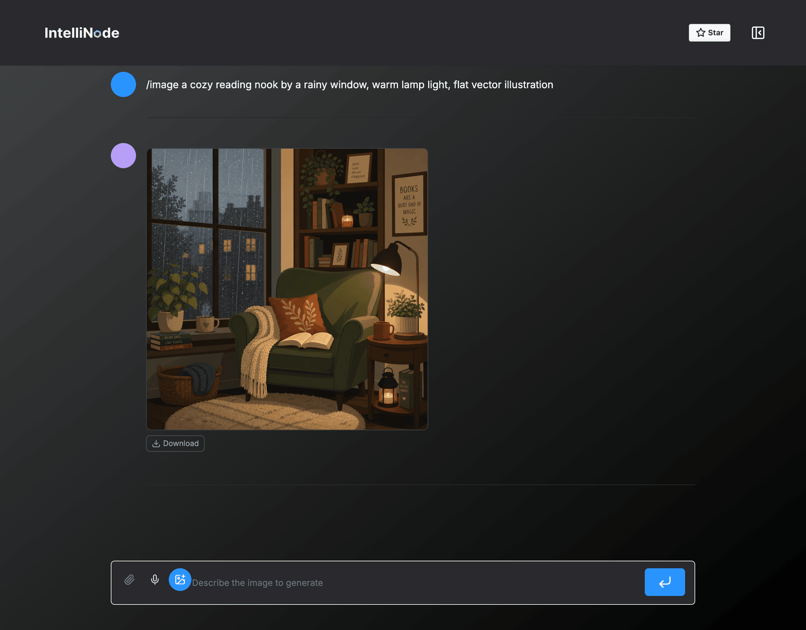
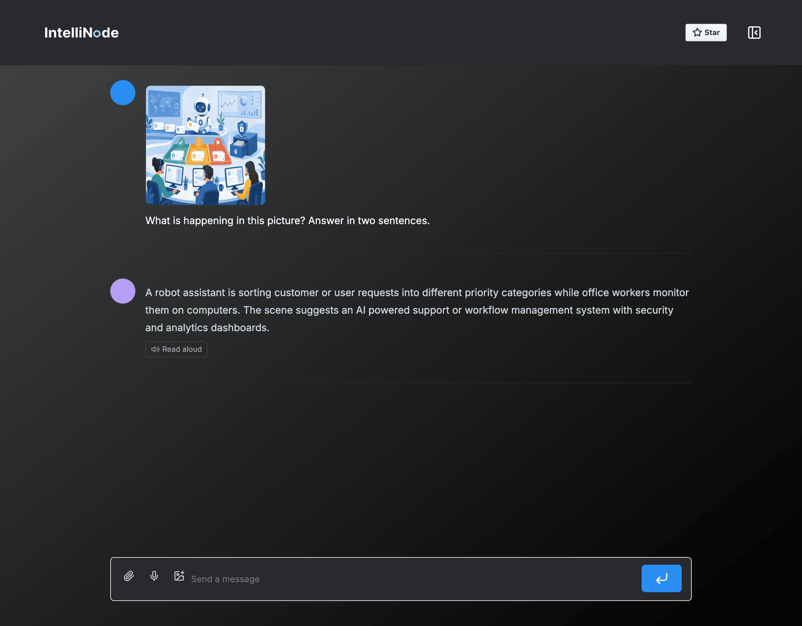
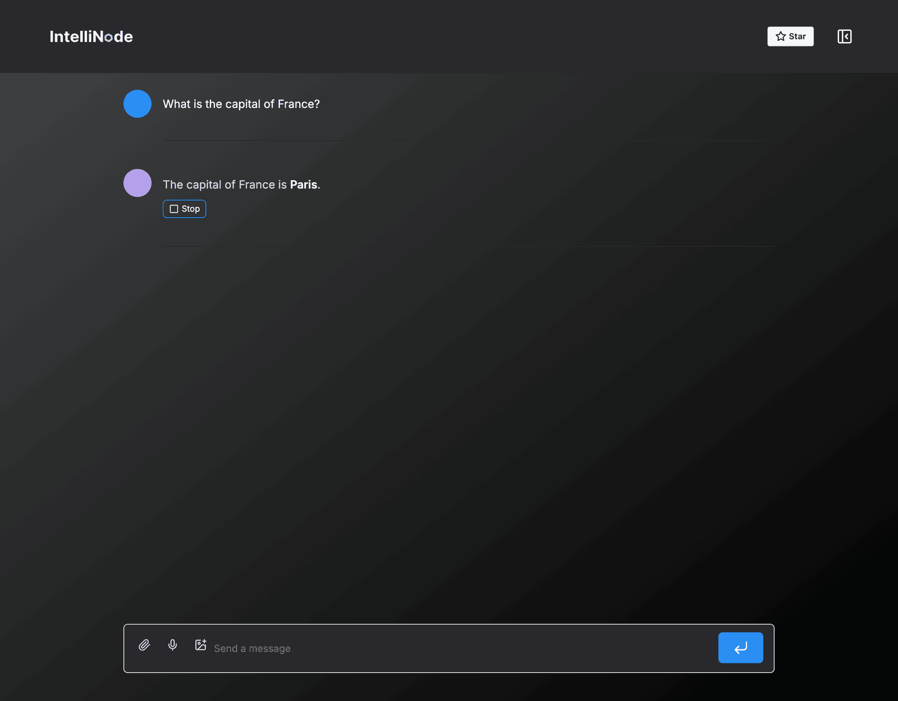
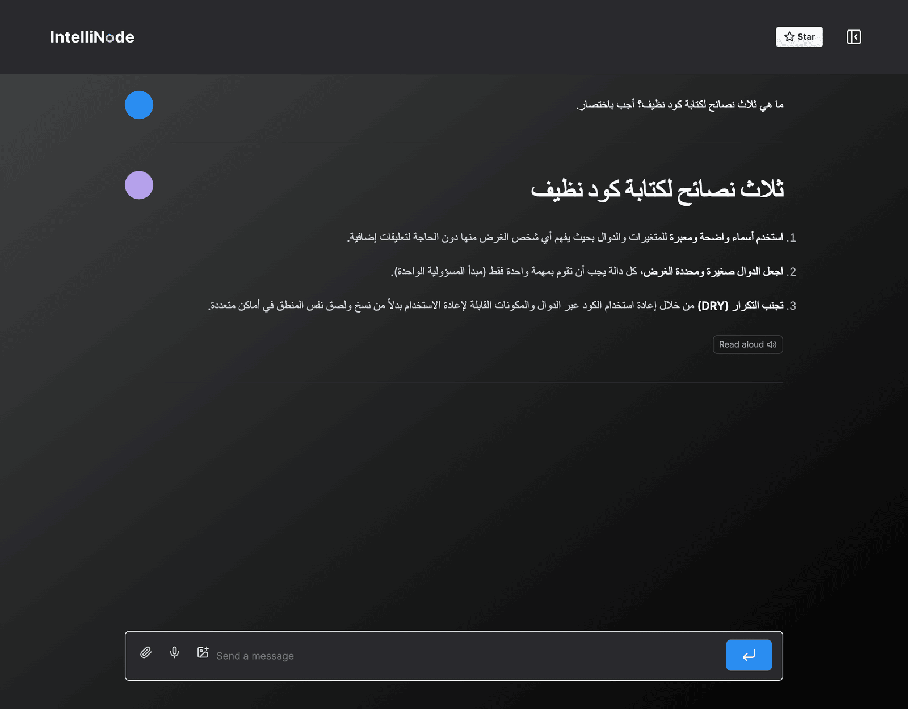
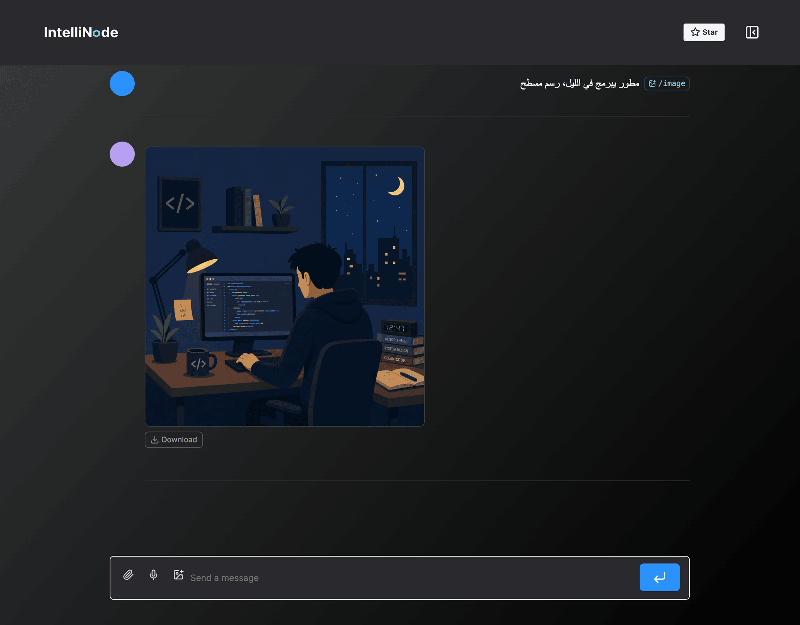
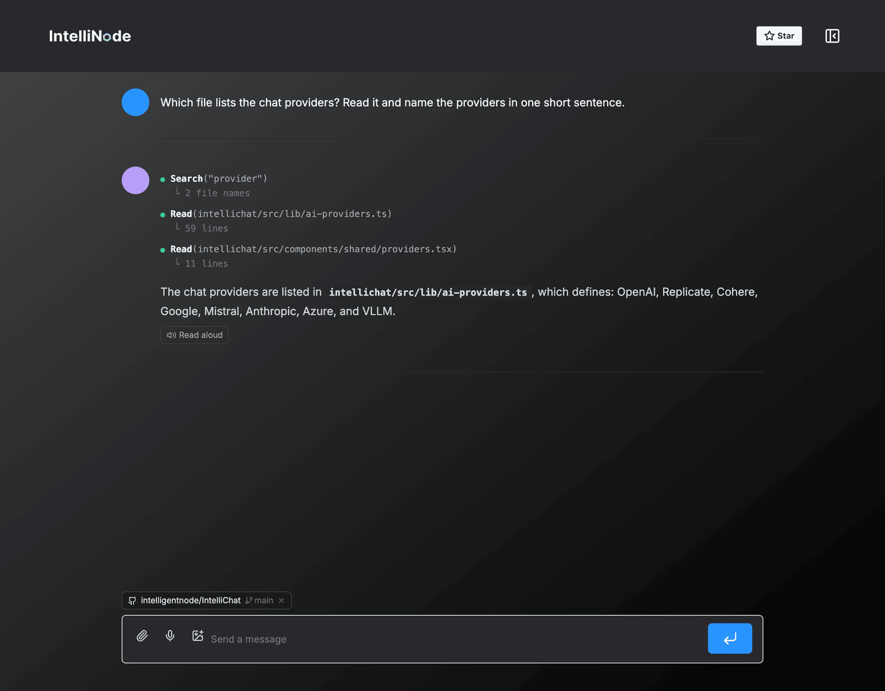
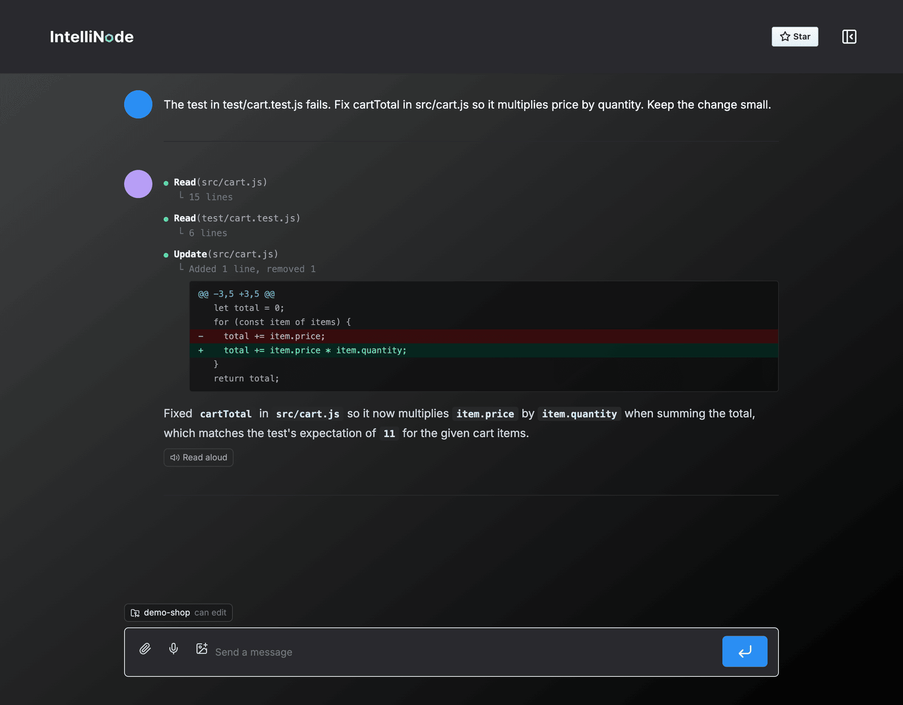
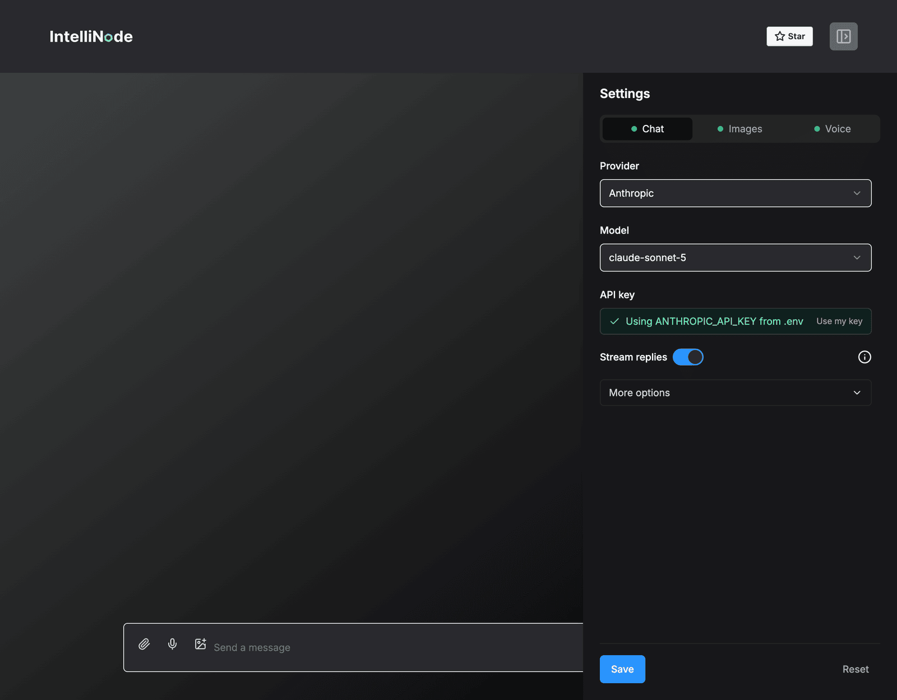
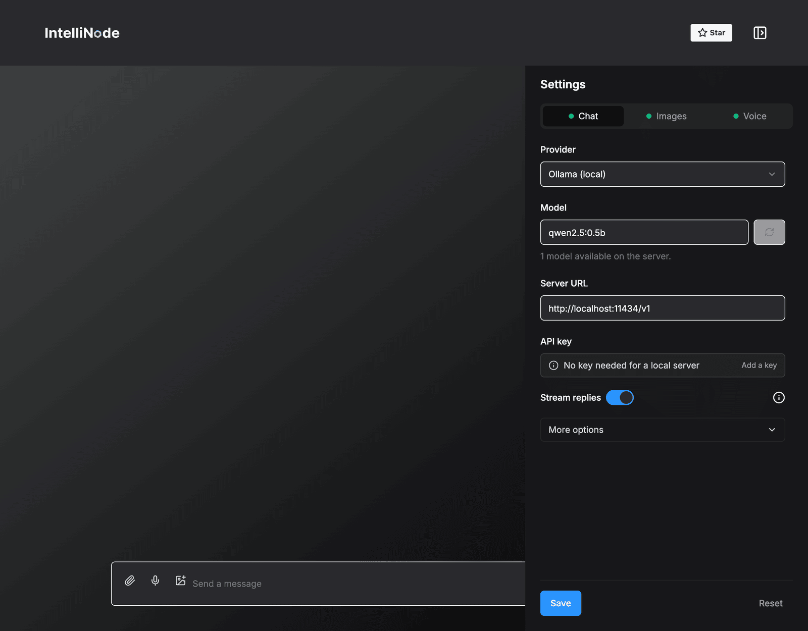

# IntelliChat

IntelliChat is an open-source AI chatbot built with [IntelliNode](https://github.com/intelligentnode/IntelliNode) and Next.js. It is designed to accelerate the integration of multiple language models into chatbot apps.

https://github.com/intelligentnode/IntelliChat/assets/2751950/47d7db12-e299-449f-9351-39185c659d84

## Features

- Select your preferred AI Provider and model from the UI.
  - **OpenAI**: GPT-5.5, GPT-5.5 Pro, GPT-5.4, GPT-5.1, GPT-4.1.
  - **Anthropic**: Claude Sonnet 5, Opus 5, Fable 5.1, Haiku 4.5.
  - **Google Gemini**: Gemini 3.6, 3.7 and 3.8 Flash, 3.1 Pro.
  - **Cohere**: Command A Plus, Command A, Command A Reasoning, Command R.
  - **Mistral AI**: Mistral Medium, Mistral Small, Magistral, Ministral.
  - **Azure OpenAI**.
  - **Replicate**: Llama chat models.
  - **OpenRouter, Groq and DeepSeek**: OpenAI-compatible APIs.
  - **Ollama, LM Studio and vLLM**: local and self-hosted models.
- Stream replies and stop them at any time.
- Generate images with the image button or `/image`.
- Attach an image and ask about it.
- Dictate messages with the microphone and listen to replies.
- Write in any language, including Arabic.
- Code blocks with highlighting, file names, copy and download.
- Paste a GitHub link to ask about a repo, file, issue or pull request.
- Connect a GitHub repo, or a local folder when running locally, and the assistant reads the code, checks issues and shows each step.
- Use the keys in `.env` or add your own in the settings, with separate keys for chat, images and voice.

| Streaming chat | Image generation |
| :---: | :---: |
|  |  |
| **Ask about an image** | **Voice** |
|  |  |
| **Arabic chat** | **Arabic image prompt** |
|  |  |
| **GitHub repo** | **Local file edit** |
|  |  |
| **Settings** | **Local models** |
|  |  |

## Installing and Running the App

1. `cd intellichat`.
2. Install the dependencies: `pnpm install` or `npm install` or `yarn install`.
3. Optional: copy `.env.example` to `.env` and add your keys. Keys can also be added from the settings.
4. Start the Next.js server `pnpm dev` or `npm run dev` or `yarn dev`.

Open [http://localhost:3000](http://localhost:3000) with your browser to see the result.

---

 

**Built with:** [Intellinode](https://github.com/intelligentnode/IntelliNode), [Next.js](https://nextjs.org/), [Shadcn](https://ui.shadcn.com/), and [TailwindCSS](https://tailwindcss.com/).
